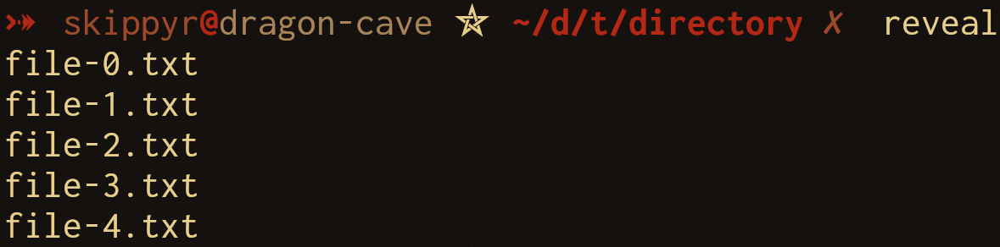

# Reveal
## About
This repository contains the source code of Reveal, a program that reveals information about entries in the filesystem of POSIX-like operating systems, such as their: contents, type, size, permissions, ownership and modified date.

Here are some previews that you can check it out:

> In the following preview, `reveal` was used to reveal the contents of a directory: its entries.



> In the following preview, `reveal` was used to reveal some information of a file: its contents, size, permissions and the user that owns it.


## Installation
### Dependencies
In order to install and run this software properly, the following dependencies must be installed:

- `git`: it will be used to clone this repository.
- `clang`, `make` and POSIX C headers: they will be used to compile the source code.

### Procedures
- Clone this repository using `git`.

```bash
git clone --depth 1 https://github.com/skippyr/reveal
```

- Access the repository's directory.

```bash
cd reveal
```

- Compile the source code using `make`.

```bash
make
```

- Add the binary `reveal`, now in the directory that you are in, to a directory that is in your system's `PATH` environment variable in order to make it an available command in your future shell sessions.

- Open a new shell session. It should now be installed and ready for you to use.

## Usage
For usage instructions and more, read its help page.

```bash
reveal -h
```

## Support
If you need any kind of support, for instance: help with troubleshooting, have questions about it or want to give improvement suggestions, please report them by filing new issues in its [issues page](https://github.com/skippyr/reveal/issues).

## Copyright
This software is under the MIT license. A copy of the license is bundled with the source code.
