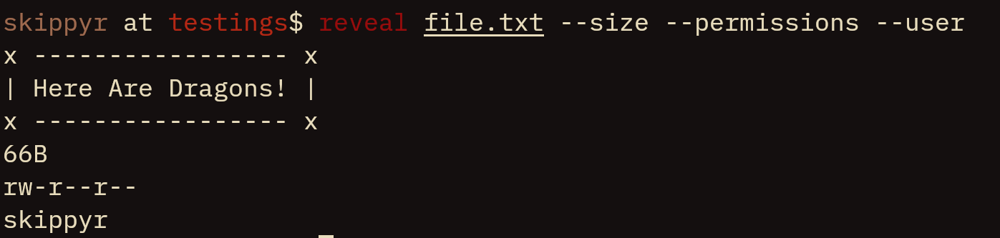

# Reveal
## About
A program that reveals information about entries in the Linux's file system, such as: contents, size, permissions, ownership and modified date.



## Installation
### Dependencies
The following dependencies must be installed to run this software properly:
-	clang.
-	make.
-	git.

### Procedures
-	Clone this repository.
```bash
git clone --depth=1 https://github.com/skippyr/reveal
```

-	Access the repository's directory.
```bash
cd reveal
```

-	Compile the source file.
```bash
make
```

-	Add the binary `reveal` to a directory tracked in your system's `PATH` environment variable.
-	Reopen your terminal emulator to reload the environment.

## Usage
For usage instructions, use read its help page.

```bash
reveal --help
```

### Copyright
Copyright (c) Sherman Rofeman. MIT license.

