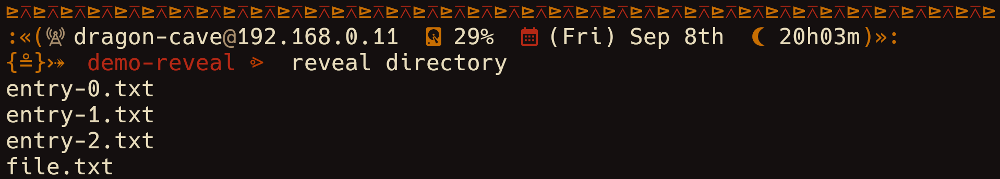
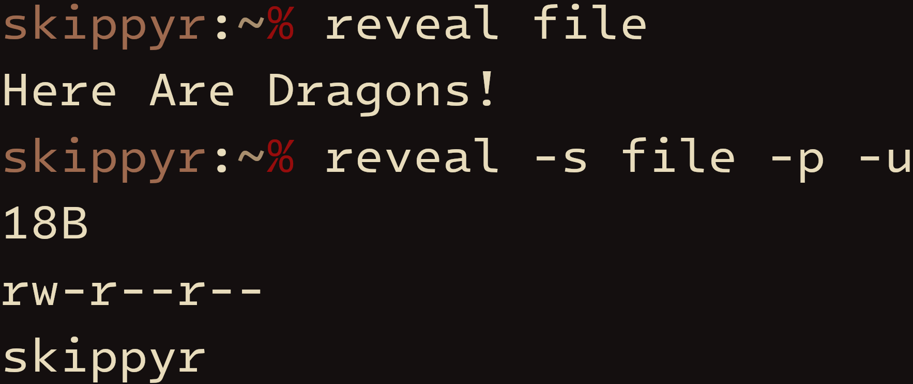

# Reveal
This repository contains the source code of Reveal, a program that reveals
information about entries in the file system of POSIX-like operating systems
such as: their contents, type, size, permissions, ownerships and modified date.

It simple options and output turns it into a great alternative for scripting
languages.

Here are some previews that you can check it out:

> In this preview, `reveal` was used to reveal the contents of a directory:
> its entries.



> In this preview, `reveal` was used to reveal the contents of a file and some
> of its properties: its size, permissions and the user that owns it.



## Installation
### Dependencies
In order to install this software, the following dependencies must be installed:

- `git`: it will be used to clone this repository.
- `make`, a C compiler (`clang`, for example) and C POSIX headers: those will
   be used to compile the source code.

### Procedures
- Clone this repository using `git`.

```bash
git clone --depth 1 https://github.com/skippyr/reveal
```

- Access the repository's directory.

```bash
cd reveal
```

- Compile the source code using `make`.

```bash
make
```

> [!NOTE]
  By default, any compilation will use `cc` as the compiler. That is usually a
  symlink for the operating system's C compiler. However, if you want to use
  another, you can give it as an argument to `make`. For instance, you can use
  `clang` instead:

```bash
make COMPILER=clang
```

- Add the binary `reveal`, now inside of the `binaries` directory, to a
  directory that is being tracked in your system's `PATH` environment variable.

- Open a new shell session. Now the program should be installed and ready
  for you to use.

## Usage
For usage instructions and more, read its help page.

```bash
reveal --help
```

## Issues And Contributions
You can use its [issues page](https://github.com/skippyr/reveal/issues) to
provide your feedback, to report any issue you are facing or to ask for help.

You can also fork it and send pull requests to be reviewed.

All kinds of contribution, from people of any skill level, is always
appreciated.

## Copyright
This software is under the MIT license. A copy of the license is bundled with
the source code.
