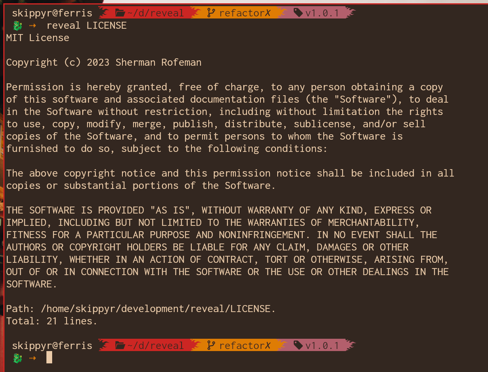
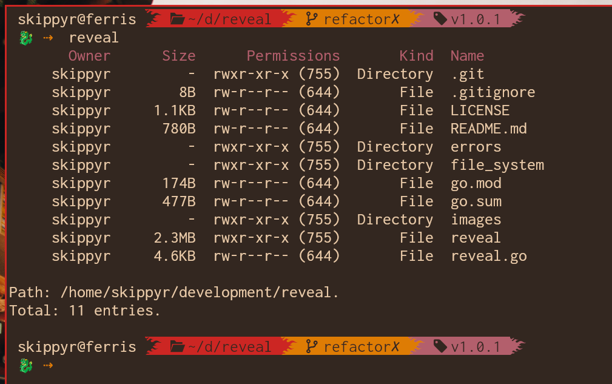
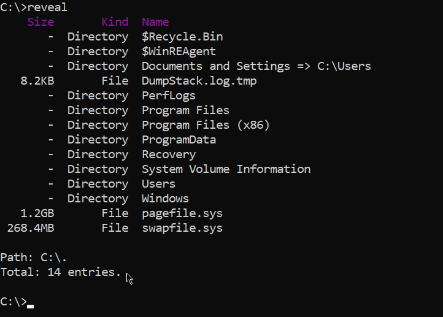

# Reveal

## Starting Point

The Reveal project is a cross-platform terminal utility to reveal directory entries and file contents.

Here are some previews that you can check out.



In this image, Reveal revealed a file on Linux.



In this image, Reveal revealed a directory on Linux.



In this image, Reveal revealed a directory on Windows.

## Installation

In order to install it, you must compile and then install it. Let's get into the steps:

### Compiling The Source Code

- Install `git`.

	This software will be used to download the source code.

- Install `go` development tools.

	These are the tools needed to compile the source code. You can find information on how to install it in its [official website](https://go.dev/doc/install).

- Clone this repository.

```bash
git clone --depth=1 https://github.com/skippyr/reveal
```

- Access the repository's directory.

```bash
cd reveal
```

- Compile the source code.

```bash
go build reveal.go
```

That will create a binary file called `reveal` on Unix-like operating systems, and `reveal.exe` on Windows. That is already the program, and can be used if you use its path.

However, in order to be able to use it as regular command: with just its name instead of running by using its path, you need to add it to a directory tracked in your system's `${PATH}` environment variable.

That variable stores a list of directory paths where the system looks for programs it can execute. Adding a new directory to it is different depending of what operating system you are using.

### Adding Binary To PATH On Unix-Like Operating Systems

In this example, the binary will be stored at `~/.local/bin`, but you can prefer to use other directory, just use its path instead when applying the examples:

* Create a directory where the binary will be stored.

```bash
mkdir -p ~/.local/bin
```

* Move the binary `reveal` to that directory.

```bash
mv reveal ~/.local/bin
```

* Add an export rule in your shell's configuration file to include that directory in the `${PATH}` environment variable.

```bash
export PATH="${PATH}:${HOME}/.local/bin"
```

That file will be:

* `~/.zshrc`: if you are using the ZSH shell.
* `~/.bashrc`: if you are using the Bash shell.

You can discover what shell you are using by using this command:

```bash
echo ${SHELL}
```

* Reopen your shell session.

After it, you should be able to execute `reveal` directly.

```powershell
reveal
```

### Adding Binary To PATH on Windows

In this example, the binary will be stored at `C:\bin`, but you can prefer to use other directory, just use its path instead when applying the examples:

* Create a directory where the binary will be stored.

```powershell
mkdir \bin
```

* Move the binary `reveal.exe` to that directory.

```powershell
move .\reveal.exe \bin
```

* Open the Advanced System Settings application, then go to Advanced > Environment Variables.

* Select the `Path` variable, then click on Edit > New.

* Add the directory where you have stored the binary, `C:\bin`, then click `Ok`.

* Restart your terminal emulator.

After it, you should be able to execute `reveal` directly.

```powershell
reveal
```

## Usage

Reveal comes with a manual that you can read to obtain usage instructions:

```bash
reveal --manual
```

## Issues

Report issues through the [issues tab](https://github.com/skippyr/reveal/issues).

## Contributions

If you want to contribute to this project, check out its [contributions guidelines](https://skippyr.github.io/materials/pages/contributions_guidelines.html).

## License

This project is released under the terms of the MIT license.

Copyright (c) 2023, Sherman Rofeman. MIT License.


