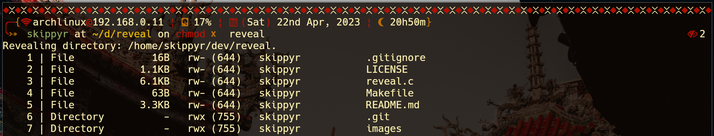
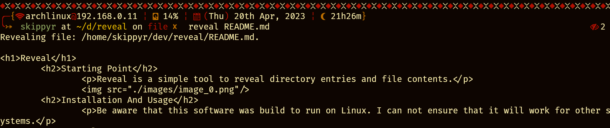

<h1>Reveal</h1>
	<h2>Starting Point</h2>
		
Reveal is a simple tool to reveal directory entries and file contents.

		
		
	<h2>Installation And Usage</h2>
		
Be aware that this software was build to run on Linux. I can not ensure that it will work for other systems.

		<ul>
			<li>Download this repository to a directory in your machine:</li>
			
If you have <code>git</code> installed, you can use it in the following command:

			<pre><code>git clone --depth 1 https://github.com/skippyr/reveal</code></pre>
			
This command will clone this repository to the directory <code>reveal</code> in your current directory, but feel free to change to whatever directory you want to by adding its path in the end of the command. The flag <code>--depth</code> with value <code>1</code> specifies to <code>git</code> that you only want to download the latest commit instead of the whole commit tree.

			
If you do not have <code>git</code> installed, you can download this repository from its page on GitHub. Access that page, click on the <code>Code</code> button on the top of the page, then click on <code>Download ZIP</code>. This will download a ZIP file containing the repository, you just have to unzip it and move to the path you want it to be.

			<li>Install <code>gcc</code> and standard C libraries:</li>
			
Those are the compiler and libraries needed to compile the source code.

			<li>Compile the source codes:</li>
			<pre><code>gcc reveal.c -o reveal</code></pre>
			<li>Execute the binary. Use <code>-h</code> or <code>--help</code> to obtain usage instructions.</li>
			<pre><code>./reveal -h</code></pre>
			
If you want, you can add that binary to your <code>PATH</code> variable to run it more easily.

		</ul>
	<h2>Issues And Contributions</h2>
		
Learn how to report issues, questions and ideas and how to contribute to this project by reading its <a href="https://skippyr.github.io/materials/pages/contributions_guideline.html">contributions guideline</a>.

	<h2>License</h2>
		
Reveal is released under the MIT License. You can refer to the license as the file <code><a href="https://github.com/skippyr/reveal/blob/main/LICENSE">LICENSE</a></code> in the root directory of this repository.

		
Copyright (c) 2023, Sherman Rofeman. MIT License.

