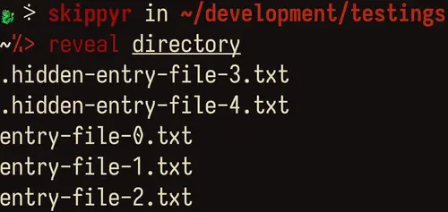
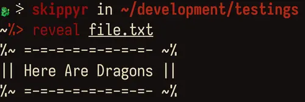
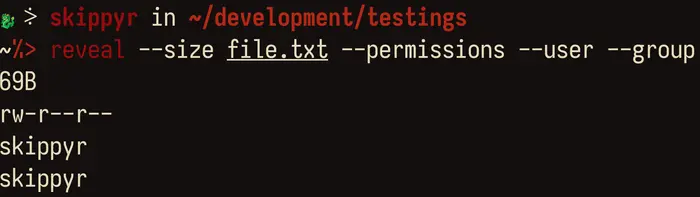

# Reveal
## About
This repository contains the source code of Reveal, a program that reveals
information about entries in the file system of POSIX-like operating systems,
such as their: contents, type, permissions, ownership and modified date.

It was created with the idea to be an alternative for some utilities from
coreutils: such as `ls`, `cat` and `stat`. By providing much simple and
scalable interactions, it becomes a perfect tool for scripting languages.

Here some usage previews that you can check out:

- Revealing a directory: in this preview, `reveal` was used to reveal the
                         contents of a directory, its entries.



- Revealing a file: in this preview, `reveal` was used to reveal the contents
                    of a file, the text inside of it.



- Revealing file properties: in this preview, `reveal` was used to reveal
                             some properties of a file: its size, permissions
                             and the user and group that owns it.



## Installation
### Dependencies
In order to install and run this software properly, the following dependencies
must be installed:

- `git`: required to clone this repository.
- `clang`, `make` and POSIX headers for C: required to compile the source code.

### Procedures
Using a command-line utility, follow these steps:

- Clone this repository using `git`.

```bash
git clone --depth 1 https://github.com/skippyr/reveal
```

The option `--depth` with value `1` specifies to Git that you only want to
download the latest commit, instead of the whole commit tree it would do
by default.

Alternatively, you can download its source code directly from GitHub. Access
its page there, click on the button labeled `Code` in the top of the page,
then, on the dropdown menu, click on `Download ZIP`.

This will download a ZIP file containing the repository, you just have to
extract it somewhere in your machine.

- Access the repository's directory.

```bash
cd reveal
```

- Compile the source code using `make`.

```bash
make
```

- Now, `reveal` should be a binary available in your current directory. Add it
  to a directory that is being tracked in your system's `PATH` environment
  variable, in order to make it an available command in all of your shell
  sessions.

- Open a new shell session to reload your environment variables. The program
  should now be installed and available for you to use.

  As a quick test, you can make it reveal your current directory:

  ```bash
  reveal
  ```

## Usage
In its help page you will find instructions on how to use it, available options
and their descriptions. Access it by running it with the `--help` option:

```bash
reveal --help
```

## Support
Report issues, questions and suggestions through its [issues page](https://github.com/skippyr/reveal/issues).

## Copyright
This software is under the MIT license. A copy of the license is bundled with
the source code.
