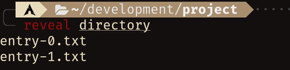
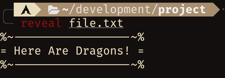
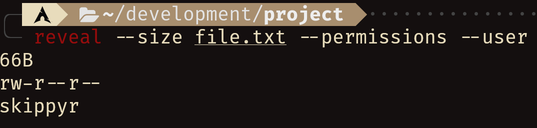

# Reveal

## About

A program that reveals information about entries in the Linux's file system,
such as their: contents, type, size, permissions, ownership and modified date.

Its behavior and features are inspired by other programs from coreutils, such as
`ls`, `cat` and `stat`, but they were planned in a way to create a simple and
scalable alternative to those ones: perfect for scripting.

Here are some previews that you can check out:

-	**Revealing a directory:** in the preview below, `reveal` was used to reveal
	the contents of a directory.

	


-	**Revealing a file:** in the preview below, `reveal` was used to reveal the
	contents of a file.

	


-	**Revealing file properties:** In the preview below, `reveal` was used to
	reveal the size, permissions and user of a file.

	


## Installation

### Dependencies

In order to install and run this software properly, the following dependencies
must be installed:

-	**`git`**: required to clone this repository.
-	**`clang`, `make` and Linux headers for C**: required to compile the source
	code.

### Procedures

Using a command-line utility, follow these steps:

-	Clone this repository using `git`.

```bash
git clone --depth 1 https://github.com/skippyr/reveal
```

-	Access the repository's directory.

```bash
cd reveal
```

-	Compile the source code using `make`.

```bash
make
```

-	Add the binary `reveal` created in the last step, that is in your current
	directory, to a directory tracked in your system's `PATH` environment
	variable, to make it available in your shell sessions.

-	Initiate a new shell session to reload your environment variables. At this
	point, the program should be installed and available as a command.

## Usage

Access its help page by running it using the `--help` option. There you will
find instructions on how to use it, available options and their descriptions.

```bash
reveal --help
```

## License

This software is under the MIT license. A copy of the license is bundled with
the source code.
