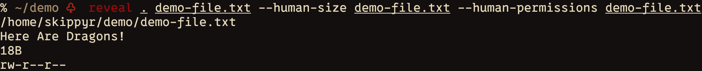

# Reveal

## Description

A terminal utility that reveals information about entries in the Linux's file
system.



## Installation

### Dependencies

The following dependencies must be installed to run this software:

-	`clang`.
-	`git`.
-	`make`.

### Procedures

-	Clone this repository.

```bash
git clone --depth=1 https://github.com/skippyr/reveal
```

-	Access the repository's directory.

```bash
cd reveal
```

-	Compile the code.

```bash
make
```

-	Add the binary `reveal` created to a directory tracked in your system's
	`${PATH}` environment variable.

### Usage

For usage details, read its help instructions.

```bash
reveal --help
```

### Support

Report issues, questions and suggestions through the [issues tab](https://github.com/skippyr/reveal/issues).

### Copyright

This software is distributed under the MIT license. A copy of the license is
bundled with the source code.

Copyright (c) 2023, Sherman Rofeman. MIT license.

