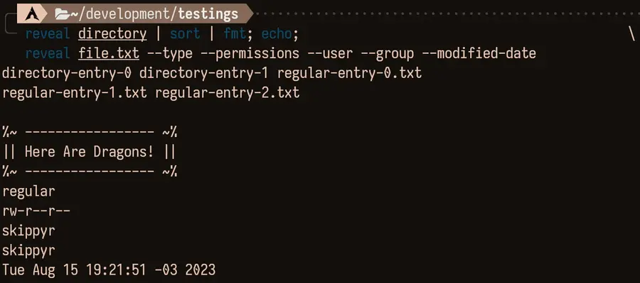

# Reveal
## About
This repository contains the source code of Reveal, a program that reveals
info about entries in the file system of POSIX-like operating system: such as
their contents, type, size, permissions, ownership and modified date.

Its simple options and output turns it into a great alternative for scripting
languages.

Here is a usage preview that you can check it out:



In this preview, `reveal` was used to get info about a regular file: its
contents, size, permissions and the user that owns it.

## Installation
### Dependencies
In order to install and run this software properly, the following dependencies
must be installed.

- `git`: it will be used to clone this repository.
- `clang`, `make` and POSIX C headers: they will be used to compile the source
                                       code.

### Procedures
- Clone this repository using `git`.

```bash
git clone --depth 1 https://github.com/skippyr/reveal
```

- Access the repository's directory.

```bash
cd reveal
```

- Compile the source code using `make`.

```bash
make
```

- Add the binary file `reveal`, now in your current directory, to a directory
  that is being tracked in your `PATH` environment variable.

- Open a new shell session to reload those variables, and now it should be
  installed.

## Usage
For usage instructions and more, read its help page.

```bash
reveal -h
```

## Support
Report issues, questions and suggestions through its [issues page](https://github.com/skippyr/reveal/issues).

## Copyright
This software is under the MIT license. A copy of the license is bundled with
the source code.
